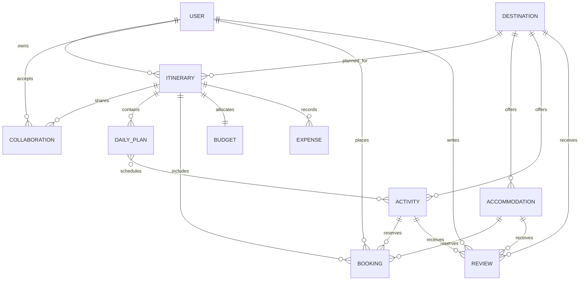

# Travel Itinerary Planning & Booking API

A Django REST Framework API that allows travellers to discover destinations,
create collaborative itineraries, organise daily plans, manage bookings, track
trip budgets, record expenses, publish reviews, and analyse travel activity.

This project was developed as part of the **Umuzi Advanced Web Development**
programme.

***

## Project Overview

The **Travel Itinerary Planning & Booking API** is a backend service for planning
and managing complete trips.

The platform combines destination discovery, itinerary planning, traveller
collaboration, accommodation and activity reservations, expense tracking,
reviews, and analytics behind a versioned REST API.

The project demonstrates several Django and REST API concepts:

- A custom user model
- JWT authentication
- Function-based views
- Class-based views
- Model ViewSets and custom ViewSet actions
- Nested serialization
- Object-level permissions
- Filtering, searching, ordering, and pagination
- Query optimization
- Model and serializer validation
- Automated API testing
- OpenAPI, Swagger, and ReDoc documentation

***

## Features

### User Accounts

Travellers can create and manage personal accounts.

The custom user profile includes:

- Unique email address
- Phone number
- Date of birth
- Biography
- Profile picture
- JSON-based travel preferences
- Traveller, travel-agent, and administrator roles

Account endpoints support registration with an initial JWT token pair, JWT
login, refresh and verification, profile management, and travel-preference
updates.

***

### Destination Discovery

Users can browse and search active travel destinations.

Destination information includes:

- Name and country
- Description
- Category and climate
- Best time to visit
- Average daily cost
- Image
- Geographic coordinates
- Average review rating

Destinations can be filtered by country, category, climate, active status, and
minimum or maximum daily cost. The API also supports text search, ordering,
popular activity results, climate-based weather guidance, and paginated results.

***

### Itinerary Planning

Authenticated users can create and manage complete travel itineraries.

Each itinerary contains:

- A destination
- Start and end dates
- Planned and actual spending
- Planning status
- Public or private visibility
- An optional itinerary PDF
- Daily plans
- Bookings
- Expenses
- Collaborators

Computed itinerary information includes trip duration, remaining budget,
collaborator totals, and booking totals. The API also supports duplication,
printable export, sharing, upcoming trip discovery, reporting, and analytics.

***

### Daily Plans

Trips can be divided into correctly ordered daily plans. Each daily plan has a
one-based day number, a date within the itinerary period, a title, notes, and
optional activities.

The model and serializer layers validate that daily-plan dates fall inside the
associated trip and that assigned activities belong to the same destination.

***

### Collaborative Trip Planning

Itinerary owners can invite other users through the `Collaboration` model.

| Role | Access |
| --- | --- |
| **Viewer** | Can view a shared itinerary |
| **Editor** | Can view and edit shared trip content |
| **Admin** | Can edit shared content and share the trip with other users |

Owners and authorized collaborators can list collaborators, add users, change
roles, remove collaborators, and share a trip through a ViewSet action.

***

### Accommodation & Activities

The booking catalogue supports two travel-product types.

#### Accommodation

Accommodation records include hotel, hostel, rental, resort, and B&B types;
price per night; guest capacity; amenities; address and contact details; an
image; availability; and a destination relationship.

#### Activities

Activity records include tours, attractions, dining, shopping, entertainment,
and outdoor experiences, along with duration, price, participant limits,
requirements, availability, and average review rating.

Activities can also be assigned directly to itinerary daily plans.

***

### Booking Management

Travellers can reserve either accommodation or an activity for an accessible
trip.

Booking functionality includes:

- Pending, confirmed, cancelled, and completed states
- Guest and price tracking
- Booking, check-in, and check-out dates
- Confirmation-code generation
- Confirmation and cancellation actions
- Ownership-based access control
- Destination consistency validation

A booking must reference exactly one target: accommodation or an activity.

***

### Budget & Expense Tracking

Each itinerary can have a one-to-one category budget covering accommodation,
activities, food, transport, shopping, and miscellaneous costs.

Users can record itemized expenses with a category, description, amount, date,
receipt image, and notes. Expense dates are validated against the itinerary
period, and actual spending is recalculated as expenses change.

***

### Reviews

Users can review exactly one destination, accommodation, or activity. Reviews
include a rating from one to five, title, written content, visit date, optional
image metadata, and helpful-vote count.

Reviews are public to read, while only the review owner can update or delete one.

***

### Trip Reports & Analytics

The API provides trip-level and account-level reporting, including:

- Total trip count
- Total planned budget and actual spending
- Confirmed booking count and booking value
- Budget and spending grouped by trip status
- Preferred destination countries and categories
- A summary of recent trips

***

## API Architecture

The application uses all three major Django REST Framework view styles.

### Function-Based Views

| View | Methods | Purpose |
| --- | --- | --- |
| `trip_search` | GET, POST | Search destinations using query parameters or a JSON body |
| `generate_trip_report` | GET | Aggregate itinerary and booking data for the current user |
| `travel_preferences` | GET, PATCH | Retrieve or update traveller preferences |

### Class-Based Views

| View | Base class | Purpose |
| --- | --- | --- |
| `RegisterView` | `CreateAPIView` | Register a traveller and issue tokens |
| `ProfileView` | `RetrieveUpdateAPIView` | Retrieve or update the current profile |
| `ItineraryListCreateView` | `ListCreateAPIView` | List accessible trips or create an itinerary |
| `BookingDetailView` | `RetrieveUpdateDestroyAPIView` | Manage one owned booking |
| `TripCollaborationView` | `APIView` | Manage itinerary collaborators |
| `DailyPlanListCreateView` | `ListCreateAPIView` | Manage nested daily plans |

### ViewSets

| ViewSet | Type | Important actions |
| --- | --- | --- |
| `DestinationViewSet` | `ReadOnlyModelViewSet` | `popular_activities`, `weather_info` |
| `ItineraryViewSet` | `ModelViewSet` | `duplicate`, `export_pdf`, `share_with_user`, `upcoming_trips` |
| `AccommodationViewSet` | `ReadOnlyModelViewSet` | Filtered accommodation catalogue |
| `ActivityViewSet` | `ReadOnlyModelViewSet` | Filtered activity catalogue |
| `BookingViewSet` | `ModelViewSet` | `confirm`, `cancel` |
| `ReviewViewSet` | `ModelViewSet` | `helpful` |
| `BudgetViewSet` | `ModelViewSet` | Category budget management |
| `ExpenseViewSet` | `ModelViewSet` | Itemized expense management |
| `TripAnalyticsViewSet` | `ViewSet` | `budget_summary`, `destination_preferences` |

***

## Request & Data Flow

Requests pass through authentication, permissions, validation, and the ORM before
a response is serialized.

```text
Client Request
      ↓
Versioned URL Router
      ↓
JWT Authentication
      ↓
View / ViewSet
      ↓
Permission Checks
      ↓
Serializer Validation
      ↓
Django ORM
      ↓
Database
      ↓
Serialized JSON Response
```

For example, when a traveller creates an itinerary:

```text
POST /api/v1/itineraries/
      ↓
JWT user identified
      ↓
Dates and budget validated
      ↓
Owner assigned automatically
      ↓
Itinerary and one-to-one Budget created
      ↓
201 Created response
```

***

## Database Models

| Model | Purpose |
| --- | --- |
| `User` | Custom traveller account, role, profile, and preferences |
| `Destination` | Searchable destination catalogue |
| `Itinerary` | Main trip-planning record |
| `Collaboration` | Through model connecting users and itineraries |
| `DailyPlan` | Date-specific itinerary schedule |
| `Accommodation` | Bookable lodging catalogue |
| `Activity` | Bookable and schedulable travel activities |
| `Booking` | Accommodation or activity reservation |
| `Review` | User rating for one travel target |
| `Budget` | One-to-one itinerary category budget |
| `Expense` | Itemized itinerary spending |

The schema demonstrates one-to-one, foreign-key, and many-to-many relationships;
a custom through model; unique constraints; database indexes; text choices; JSON
fields; file and image fields; and automatic timestamps.

***

## Entity Relationship Diagram



***

## Project Structure

```text
enye-travel-api/
├── accounts/
│   ├── admin.py
│   ├── models.py
│   ├── serializers.py
│   ├── urls.py
│   └── views.py
├── destinations/
│   ├── filters.py
│   ├── models.py
│   ├── serializers.py
│   ├── urls.py
│   └── views.py
├── itineraries/
│   ├── filters.py
│   ├── permissions.py
│   ├── models.py
│   ├── serializers.py
│   ├── urls.py
│   └── views.py
├── bookings/
│   ├── filters.py
│   ├── permissions.py
│   ├── models.py
│   ├── serializers.py
│   ├── urls.py
│   └── views.py
├── budgets/
│   ├── models.py
│   ├── serializers.py
│   ├── urls.py
│   └── views.py
├── reviews/
│   ├── models.py
│   ├── serializers.py
│   ├── urls.py
│   └── views.py
├── config/
│   ├── pagination.py
│   ├── settings.py
│   ├── test_helpers.py
│   ├── urls.py
│   ├── asgi.py
│   └── wsgi.py
├── tests/
│   ├── test_auth_permissions.py
│   ├── test_models.py
│   ├── test_serializers.py
│   └── test_views.py
├── .env.example
├── .gitignore
├── manage.py
├── pytest.ini
├── requirements.txt
└── README.md
```

***

## Technologies Used

- **Python**
- **Django**
- **Django REST Framework**
- **Simple JWT**
- **django-filter**
- **drf-spectacular**
- **python-decouple**
- **django-cors-headers**
- **Pillow**
- **SQLite** and **PostgreSQL** support
- **pytest** and **pytest-django**
- **Coverage.py**
- **Gunicorn**

***

## Authentication Flow

### Registration

```http
POST /api/v1/accounts/register/
```

Example request:

```json
{
  "username": "alex",
  "email": "alex@example.com",
  "password": "StrongPass123!",
  "password_confirm": "StrongPass123!"
}
```

Registration returns the new user and a JWT token pair.

### Login

Tokens can be obtained through either endpoint:

```http
POST /api/v1/accounts/login/
POST /api/v1/token/
```

Send the access token with authenticated requests:

```http
Authorization: Bearer <access-token>
```

Refresh or verify tokens with:

```http
POST /api/v1/token/refresh/
POST /api/v1/token/verify/
```

An account-scoped refresh endpoint is also available at
`/api/v1/accounts/token/refresh/`.

***

## Permissions

The API combines ownership-scoped querysets with object-level permission classes.

| Permission | Purpose |
| --- | --- |
| `IsTripOwner` | Restricts owner-only itinerary operations |
| `IsTripOwnerOrCollaborator` | Allows owners and invited collaborators |
| `CanEditItinerary` | Allows owners and editor/admin collaborators to write |
| `IsBookingOwner` | Restricts booking operations to the booking owner |
| `IsReviewOwnerOrReadOnly` | Allows public reads and author-only writes |

***

## Filtering, Search & Pagination

The project provides `DestinationFilter`, `ItineraryFilter`, and `BookingFilter`,
alongside `DjangoFilterBackend`, `SearchFilter`, `OrderingFilter`, and bounded
page-number pagination.

Example destination query:

```http
GET /api/v1/destinations/?country=South%20Africa&max_daily_cost=200&search=Cape&ordering=avg_daily_cost
```

Example itinerary query:

```http
GET /api/v1/itineraries/?status=planning&starts_after=2027-01-01&ordering=start_date
```

***

## Query Optimization

The API uses `select_related`, `prefetch_related`, custom `Prefetch` querysets,
`only`, `annotate`, `aggregate`, `F` expressions, and `Q` objects throughout the
view layer. These techniques reduce unnecessary queries, optimize nested
resources, and perform totals and filtering in the database.

***

## API Endpoints

All application endpoints use the `/api/v1/` prefix.

### Accounts & Authentication

| Method | Endpoint | Purpose |
| --- | --- | --- |
| POST | `/api/v1/accounts/register/` | Register and receive tokens |
| POST | `/api/v1/accounts/login/` | Log in and receive tokens |
| GET, PATCH | `/api/v1/accounts/profile/` | Retrieve or update a profile |
| GET, PATCH | `/api/v1/accounts/preferences/` | Retrieve or update preferences |
| POST | `/api/v1/token/` | Obtain a JWT token pair |
| POST | `/api/v1/token/refresh/` | Refresh an access token |
| POST | `/api/v1/token/verify/` | Verify an access token |

### Destinations

| Method | Endpoint | Purpose |
| --- | --- | --- |
| GET | `/api/v1/destinations/` | List destinations |
| GET | `/api/v1/destinations/{id}/` | Retrieve a destination |
| GET | `/api/v1/destinations/{id}/popular_activities/` | List popular activities |
| GET | `/api/v1/destinations/{id}/weather_info/` | Retrieve climate guidance |
| GET, POST | `/api/v1/destinations/search/` | Search destinations |

### Itineraries & Nested Resources

| Method | Endpoint | Purpose |
| --- | --- | --- |
| GET, POST | `/api/v1/itineraries/` | List or create itineraries |
| GET, PUT, PATCH, DELETE | `/api/v1/itineraries/{id}/` | Manage one itinerary |
| POST | `/api/v1/itineraries/{id}/duplicate/` | Duplicate an itinerary |
| GET, POST | `/api/v1/itineraries/{id}/export_pdf/` | Export or persist itinerary content |
| POST | `/api/v1/itineraries/{id}/share_with_user/` | Share an itinerary |
| GET | `/api/v1/itineraries/upcoming_trips/` | List upcoming trips |
| GET, POST | `/api/v1/trips/` | Generic list/create itinerary endpoint |
| GET | `/api/v1/trips/report/` | Generate an account trip report |
| GET, POST | `/api/v1/trips/{id}/days/` | List or create trip days |
| GET, POST, PATCH, DELETE | `/api/v1/trips/{id}/collaborations/` | Manage collaborators |

For collaborator updates and removals, include `collaboration_id` in the request
body.

### Accommodation, Activities & Bookings

| Method | Endpoint | Purpose |
| --- | --- | --- |
| GET | `/api/v1/accommodations/` | Browse accommodation |
| GET | `/api/v1/accommodations/{id}/` | Retrieve accommodation |
| GET | `/api/v1/activities/` | Browse activities |
| GET | `/api/v1/activities/{id}/` | Retrieve an activity |
| GET, POST | `/api/v1/bookings/` | List or create bookings |
| GET, PUT, PATCH, DELETE | `/api/v1/bookings/{id}/` | Manage an owned booking |
| POST | `/api/v1/bookings/{id}/confirm/` | Confirm a pending booking |
| POST | `/api/v1/bookings/{id}/cancel/` | Cancel a booking |

### Budgets, Expenses & Reviews

| Method | Endpoint | Purpose |
| --- | --- | --- |
| GET, POST | `/api/v1/budgets/` | List or create budgets |
| GET, PUT, PATCH, DELETE | `/api/v1/budgets/{id}/` | Manage a trip budget |
| GET, POST | `/api/v1/expenses/` | List or create expenses |
| GET, PUT, PATCH, DELETE | `/api/v1/expenses/{id}/` | Manage an expense |
| GET, POST | `/api/v1/reviews/` | List or create reviews |
| GET, PUT, PATCH, DELETE | `/api/v1/reviews/{id}/` | Manage a review |
| POST | `/api/v1/reviews/{id}/helpful/` | Mark a review as helpful |

### Analytics & Documentation

| Method | Endpoint | Purpose |
| --- | --- | --- |
| GET | `/api/v1/analytics/` | Retrieve trip summary analytics |
| GET | `/api/v1/analytics/budget_summary/` | Retrieve grouped budget analytics |
| GET | `/api/v1/analytics/destination_preferences/` | Retrieve destination preferences |
| GET | `/api/v1/schema/` | Retrieve the OpenAPI schema |
| GET | `/api/v1/docs/swagger/` | Open Swagger UI |
| GET | `/api/v1/docs/redoc/` | Open ReDoc |

***

## Testing

The repository contains **51 test methods** across model, serializer,
authentication, permission, and endpoint suites.

| Test area | Focus |
| --- | --- |
| Models | Validation, computed properties, transitions, and custom methods |
| Serializers | Nested output, field validation, and create/update behavior |
| Authentication | Registration, JWT login, profiles, and preferences |
| Permissions | Owner, collaborator, viewer, outsider, and booking access |
| API views | Search, CRUD, custom actions, reports, analytics, and documentation |

Run the suite with either command:

```bash
pytest
python manage.py test
```

Generate coverage with:

```bash
coverage run -m pytest
coverage report
coverage html
```

Validate the project and OpenAPI schema with:

```bash
python manage.py check
python manage.py spectacular --validate --file schema.yml
```

***

## Getting Started

### Prerequisites

- Python 3.10 or newer
- pip
- Git

### 1. Clone the Repository

```bash
git clone https://github.com/Olwethu28/enye-travel-api.git
cd enye-travel-api
```

### 2. Create and Activate a Virtual Environment

```bash
python -m venv .venv
source .venv/bin/activate
```

On Windows, activate it with:

```powershell
.venv\Scripts\activate
```

### 3. Install Dependencies

```bash
pip install -r requirements.txt
```

### 4. Configure Environment Variables

```bash
cp .env.example .env
```

Set a long, private `SECRET_KEY` before deploying. Available values include:

```text
SECRET_KEY
DEBUG
ALLOWED_HOSTS
DATABASE_ENGINE
DATABASE_NAME
DATABASE_USER
DATABASE_PASSWORD
DATABASE_HOST
DATABASE_PORT
CORS_ALLOWED_ORIGINS
```

### 5. Create and Apply Database Migrations

```bash
python manage.py makemigrations
python manage.py migrate
```

### 6. Create an Administrator

```bash
python manage.py createsuperuser
```

### 7. Start the Development Server

```bash
python manage.py runserver
```

The API will be available at `http://127.0.0.1:8000/api/v1/`, and Swagger UI
will be available at `http://127.0.0.1:8000/api/v1/docs/swagger/`.

***

## Available Commands

| Command | Purpose |
| --- | --- |
| `python manage.py runserver` | Run the development server |
| `python manage.py makemigrations` | Create database migrations |
| `python manage.py migrate` | Apply database migrations |
| `python manage.py createsuperuser` | Create an administrator |
| `pytest` | Run the pytest suite |
| `python manage.py test` | Run tests with Django's test runner |
| `python manage.py check` | Validate project configuration |
| `python manage.py spectacular --validate --file schema.yml` | Export OpenAPI |
| `python manage.py collectstatic` | Collect production static files |
| `gunicorn config.wsgi:application` | Run the WSGI app with Gunicorn |

***

## Static & Media Files

```text
STATIC_ROOT = staticfiles/
MEDIA_ROOT = media/
MEDIA_URL = /media/
```

Uploaded content can include profile pictures, destination images, accommodation
images, activity images, itinerary PDF files, and expense receipts.

***

## Code Quality

The project uses environment-based secrets, versioned and namespaced routes,
owner-scoped querysets, object-level permissions, serializer inheritance, model
and serializer validation, database indexes, query optimization, atomic database
updates, automated tests, and generated OpenAPI documentation.

***

## Learning Objectives

This project demonstrates practical experience with Django project structure,
custom user models, relational data design, model validation, nested serializers,
all three DRF view styles, JWT authentication, object-level authorization,
filtering and pagination, ORM optimization, database expressions, API versioning,
automated testing, and OpenAPI documentation.

***

## Author

**Olwethu Manqola**

Developed as part of the **Umuzi Advanced Web Development Programme**.

***

## Repository

[GitHub Repository](https://github.com/Olwethu28/enye-travel-api)

***

## Built With

```text
Python + Django + Django REST Framework
```

Built with a focus on secure REST API design, relational data modelling, reusable
backend architecture, query performance, automated testing, and clear API
documentation.
